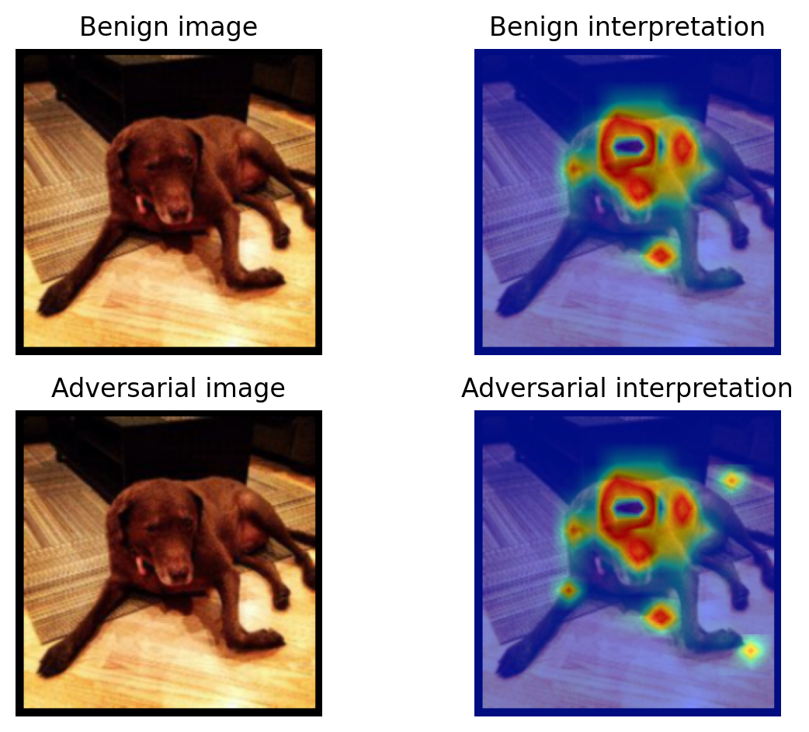

# AdV<sup>2</sup>iT: Attacking Interpretable Vision Transformers


## Requirements
```bash
pip install -r requirements.txt
```

## Quickstart
Run the demo using the following script:
```bash
python test.py --img_path images/fold_0.npz --src_model deit_base_patch16_224 --tar_model lrp_b --attack_type pgd --eps 8 --index “all” --batch_size 1
```

The script uses **DeiT-B** model as a source model and **ViT-B** as a target model. The algorithms attacks [Transformer Interpreter](https://github.com/hila-chefer/Transformer-Explainability) model. The models will be downloaded automatically once the script is run. 


## Input
Input should be in the _npz_ format. In the format there is a key called _img_x_ that stores the image in the numpy format. For the test, there are example images provided in the **images** folder.

## Output
Output is in _npz_ format. The algorithm saves the output in the **output** folder.


## Visualization
To visualize the output, run the following script after the attack process:
```bash
python visualize.py --img_path output/output_fold_0.npz
```

## Visualization Output
Output is in _png_ format. The algorithm saves the output in the **visualization** folder.




**Note**: I recommend to play with hyperparameters to get the best results.
